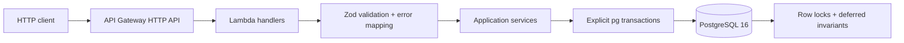

# Kipu Wallet Ledger

Motor de billetera en Node.js y TypeScript sobre PostgreSQL, con ledger inmutable de partida doble, saldos materializados verificables, transferencias idempotentes y control pesimista de concurrencia.

## Qué resuelve

- Cuentas con saldo contable, retenido y disponible.
- Saldo inicial registrado como una transacción de partida doble.
- Transferencias atómicas sin sobregiros, incluso bajo concurrencia.
- `Idempotency-Key` transaccional: una misma operación mueve dinero una sola vez.
- Holds con creación, captura, liberación y expiración basada en el reloj de PostgreSQL.
- Ledger append-only con débitos y créditos cuya suma es cero.
- Extracto descendente con paginación keyset por cursor estable.
- Logs JSON con `correlationId`.
- Pruebas unitarias, integración real y un escenario de estrés reproducible.

Las decisiones, ambigüedades y el ejercicio de code review están desarrollados en [DECISIONS.md](./DECISIONS.md).

## Arquitectura



Cada ruta de `serverless.yml` apunta a una función Lambda independiente. Los handlers adaptan HTTP; las reglas de negocio viven en servicios. Las operaciones monetarias críticas usan SQL explícito y transacciones administradas con `pg`.

## Inicio rápido: desde cero en 5 comandos

Requisitos: Node.js 20 o superior, npm y Docker con Compose v2.

```bash
cp .env.example .env
npm ci
docker compose up -d --wait postgres
npm run db:migrate
npm run dev
```

La API queda disponible en `http://localhost:3000`. PostgreSQL escucha en `localhost:5432`. El contenedor crea `kipu` para desarrollo y `kipu_test` para integración.

Para detener la infraestructura:

```bash
docker compose down
```

Para eliminar también los datos locales, usa conscientemente `docker compose down -v`.

## Comandos de calidad

```bash
npm test                  # 22 pruebas unitarias; no requiere PostgreSQL
npm run test:integration  # 21 pruebas contra kipu_test
npm run test:all          # unitarias + integración
npm run stress            # 110 transferencias + 20 reintentos idempotentes
npm run lint
npm run typecheck
npm run build             # typecheck + empaquetado Serverless
npm run check             # lint + typecheck + unitarias
```

`test:integration` ejecuta `TRUNCATE` en la base de pruebas. Ignora `DATABASE_URL` y usa `TEST_DATABASE_URL`, cuyo valor predeterminado apunta a `kipu_test`; no la sustituyas por una base con información que quieras conservar.

El script de estrés no borra datos. Crea cuatro cuentas con prefijo `Stress <runId>`, dispara transferencias que compiten por fondos y operaciones cruzadas A→B/B→A, y comprueba mediante `assert`:

1. Ninguna cuenta de cliente termina negativa.
2. La suma del dinero de las cuatro cuentas se conserva.
3. Cada saldo materializado coincide con la suma de sus asientos.
4. Veinte reintentos simultáneos con la misma llave producen un solo movimiento.

## Contrato monetario

Todos los montos de entrada y salida son strings decimales, por ejemplo `"25.50"`. Se aceptan cero, una o dos cifras decimales según la operación; nunca notación científica, signos, espacios, separadores de miles ni más de dos decimales. Internamente se convierten a centavos en `BIGINT`, sin aritmética de coma flotante.

El sistema usa una única moneda, `USD`. Cambiar a multimoneda exigiría cuentas internas y reglas contables por moneda; no basta con cambiar una variable de entorno.

## API REST

| Método | Ruta | Propósito | Éxito |
|---|---|---|---|
| `POST` | `/accounts` | Crear una cuenta con saldo inicial opcional | `201` |
| `GET` | `/accounts/{accountId}/balance` | Consultar saldos contable, retenido y disponible | `200` |
| `POST` | `/transfers` | Transferir con `Idempotency-Key` | `201` |
| `POST` | `/accounts/{accountId}/holds` | Crear una retención | `201` |
| `POST` | `/holds/{holdId}/capture` | Capturar el monto completo de un hold | `200` |
| `POST` | `/holds/{holdId}/release` | Liberar un hold | `200` |
| `GET` | `/accounts/{accountId}/ledger` | Extracto por cursor, con `limit` de 1 a 100 | `200` |

### Crear una cuenta

```bash
curl -sS -X POST http://localhost:3000/accounts \
  -H 'content-type: application/json' \
  -d '{"owner":"Ada Lovelace","initialBalance":"1000.00"}'
```

`initialBalance` es opcional y toma `"0.00"` por defecto. Un saldo inicial positivo genera un crédito en la cuenta y un débito equivalente en la cuenta interna de apertura.

### Transferir

```bash
curl -sS -X POST http://localhost:3000/transfers \
  -H 'content-type: application/json' \
  -H 'Idempotency-Key: transfer-order-42' \
  -d '{
    "sourceAccountId":"<uuid-origen>",
    "destinationAccountId":"<uuid-destino>",
    "amount":"25.50"
  }'
```

Repetir exactamente el request con la misma llave devuelve el mismo status y cuerpo almacenados. Reutilizarla con otro payload devuelve `409 IDEMPOTENCY_KEY_REUSED`.

### Crear y resolver un hold

```bash
curl -sS -X POST http://localhost:3000/accounts/<uuid-cuenta>/holds \
  -H 'content-type: application/json' \
  -d '{"amount":"40.00","expiresAt":"2030-01-01T00:00:00.000Z"}'

curl -sS -X POST http://localhost:3000/holds/<uuid-hold>/capture
curl -sS -X POST http://localhost:3000/holds/<uuid-hold>/release
```

La captura es total. Capturar de nuevo el mismo hold devuelve la captura original; liberar de nuevo uno liberado devuelve su estado. Una carrera entre captura y liberación tiene un único ganador por el bloqueo de cuenta y hold.

### Paginar el extracto

```bash
curl -sS 'http://localhost:3000/accounts/<uuid-cuenta>/ledger?limit=20'
curl -sS 'http://localhost:3000/accounts/<uuid-cuenta>/ledger?limit=20&cursor=<nextCursor>'
```

El cursor codifica `(created_at, entry_id)`. La página siguiente usa una comparación estrictamente menor sobre ese par, por lo que movimientos nuevos no desplazan ni duplican los movimientos ya paginados.

## Formato de errores

Todas las rutas responden errores con la misma forma:

```json
{
  "error": {
    "code": "INSUFFICIENT_FUNDS",
    "message": "source account has insufficient available funds",
    "correlationId": "api-gateway-request-id"
  }
}
```

Los errores de validación pueden incluir `details` con `path` y `message`.

- `400`: JSON, headers, UUID, cursor o estructura inválidos.
- `404`: cuenta o hold inexistente.
- `409`: fondos insuficientes, conflicto de idempotencia o transición inválida.
- `422`: monto semánticamente inválido, misma cuenta, moneda o expiración.
- `500`: error inesperado sin filtrar detalles internos al cliente.

Cada respuesta incluye `x-correlation-id` y cada ejecución emite un log JSON de finalización o fallo.

## Modelo de datos e invariantes

- `accounts`: saldo materializado en unidades menores. Las cuentas de cliente tienen `CHECK balance_minor >= 0`.
- `ledger_transactions`: cabecera semántica del movimiento.
- `ledger_entries`: asientos firmados; positivos son créditos y negativos son débitos.
- `holds`: reserva, estado y expiración. Un hold activo no altera el saldo contable.
- `idempotency_keys`: hash canónico del request y respuesta de transferencia.
- `schema_migrations`: migraciones aplicadas bajo advisory lock.

PostgreSQL impide `UPDATE` y `DELETE` sobre el ledger. Constraint triggers diferidos verifican al confirmar cada transacción que el movimiento tenga al menos dos asientos, sume cero, conserve moneda y no deje divergencia entre los saldos materializados y el ledger.

## Estructura

```text
migrations/              SQL incremental e invariantes de base de datos
src/config/              configuración validada
src/db/                  pool, transacciones y runner de migraciones
src/domain/              dinero y cursor
src/handlers/            adaptadores Lambda/HTTP
src/http/                parsing y respuestas consistentes
src/services/            casos de uso y SQL explícito
tests/unit/              lógica pura
tests/integration/       PostgreSQL, concurrencia e invariantes
scripts/stress.ts        demostración concurrente
requests/kipu.http       colección manual de requests
serverless.yml           funciones AWS y ejecución offline
docker-compose.yml       PostgreSQL local
```

## Configuración para AWS

`serverless.yml` declara Node.js 20, memoria, timeouts y variables de entorno. Un despliegue real requeriría VPC/subnets, security groups, RDS Proxy o un pool compatible con Lambda, Secrets Manager y permisos IAM. No se incluyen porque el challenge exige ejecución local, no infraestructura cloud completa.
